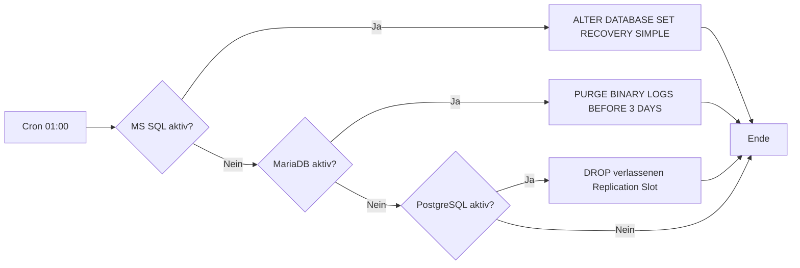

# Passwortlose & stun-freie Backup-Architektur für Linux-Datenbanken via Veeam & Uyuni

Dieses Repository enthält die Salt-States für **Uyuni (SaltStack)** und die lokalen Skripte zur Implementierung einer hochsicheren, performanten und vollständig automatisierten Backup-Architektur für Linux-VMs mit relationalen Datenbanken (**MariaDB/MySQL, PostgreSQL, MS SQL Server**).

---

## 1. Die Herausforderung

Klassische Backup-Konzepte stoßen bei geschäftskritischen Datenbanken an zwei fundamentale Grenzen:

### Konflikt A: Sicherheit vs. Offene Netzwerkports (Lateral Movement)

| | |
|---|---|
| **Problem** | Agentenbasierte Backups erfordern entweder die Speicherung administrativer Zugangsdaten auf dem zentralen Veeam-Server (Sicherheitsrisiko bei Kompromittierung) oder die Öffnung von Outbound-Netzwerkports von den produktiven VMs in Richtung Backup-Infrastruktur (Risiko von Lateral Movement bei einer Kompromittierung einer produktiven VM). |
| **Lösung** | **Pull-Verfahren:** Vollständige Blockierung jeglichen Netzwerkverkehrs aus dem Datenbank-VLAN in das Backup-VLAN auf Firewall-Ebene. Veeam greift ausschließlich über das vCenter und die Management-Schnittstellen des Speichersystems zu. Die VMs sind netzwerktechnisch isoliert und initiieren keine Verbindungen nach außen. |

### Konflikt B: Datenkonsistenz vs. Latenzen im Millisekundenbereich (VM-Stun)

| | |
|---|---|
| **Problem** | Das Erstellen und insbesondere das Löschen (Konsolidieren) von VMware-Snapshots führt bei schreibintensiven Datenbanken zu spürbaren Latenzeinbrüchen (dem sogenannten "VM-Stun-Effekt"). Für Echtzeit-Anwendungen mit Latenzanforderungen im Millisekundenbereich ist dies inakzeptabel. |
| **Lösung** | **Veeam Backup from Storage Snapshots (BfSS).** Der VMware-Snapshot existiert nur für Bruchteile einer Sekunde. Die Datenübertragung erfolgt hardwareseitig direkt aus dem Storage-Snapshot über das SAN an den Veeam Backup Proxy. |

---

## 2. Der Lösungsansatz

Das Backup erfolgt **out-of-band** über Speicher-Snapshots — Veeam hat keinen direkten Systemzugriff auf die VMs. Dieses Repository stellt die Komponenten bereit, die auf den VMs selbst die beiden daraus resultierenden Probleme lösen: **Application Consistency** und **Log-Growth**.

### 2.1 Architektur-Übersicht

```
┌─────────────────────────────────────────────────────────────────────────┐
│                         VEEAM BACKUP SERVER                             │
│  greift zu via: vCenter + Storage Management API                        │
└──────────────┬──────────────────────────────────────────────┬───────────┘
               │ (kein direktes SSH/Agent auf den VMs!)       │
               ▼                                              ▼
┌──────────────────────────────┐          ┌──────────────────────────────┐
│         VCENTER               │          │   HPE / STORAGE-SYSTEM       │
│  löst VMware Snapshot aus     │          │  erstellt Storage-Snapshot   │
│  + ruft pre-/post-freeze auf  │          │  → Daten via SAN an Proxy    │
└──────────────┬───────────────┘          └──────────────────────────────┘
               │
               ▼
┌─────────────────────────────────────────────────────────────────────────┐
│                         LINUX VM (Datenbank)                            │
│                                                                         │
│  ┌──────────────┐    ┌──────────────────┐    ┌──────────────────────┐   │
│  │ VMware Tools  │───▶│ pre-freeze-script│───▶│ Konsistenz sichern   │   │
│  │ (ESXi Host)   │    │ (root)           │    │ • MySQL: FLUSH TABLES│   │
│  │               │    │                  │    │ • PG:    CHECKPOINT  │   │
│  │               │    │                  │    │ • MSSQL: CHECKPOINT  │   │
│  │               │◀───│ post-thaw-script │◀───│ Locks freigeben      │   │
│  └──────────────┘    └──────────────────┘    └──────────────────────┘   │
│                                                                         │
│  ┌──────────────────────────────────────────────────────────────────┐   │
│  │  Cron (täglich 01:00) ───▶ db_log_cleanup.sh                     │   │
│  │    • MS SQL:   SIMPLE Recovery (LDF-Wachstum stoppen)            │   │
│  │    • MariaDB:  PURGE BINARY LOGS (Binlogs > 3 Tage)              │   │
│  │    • PostgreSQL: DROP REPLICATION SLOT (verwaiste WALs)          │   │
│  └──────────────────────────────────────────────────────────────────┘   │
│                                                                         │
│  Verwaltet durch: Uyuni (SaltStack) — zentrales Deployment             │
└─────────────────────────────────────────────────────────────────────────┘
```

### 2.2 Die drei Komponenten

| Komponente | Zweck | Ausführung | Ziel |
|---|---|---|---|
| **`pre-freeze-script`** | Datenbank in konsistenten Zustand versetzen | VMware Tools vor dem Snapshot (als root) | Application-consistentes Backup |
| **`post-thaw-script`** | Datenbank-Locks freigeben | VMware Tools nach dem Snapshot (als root) | Keine blockierten Datenbankverbindungen |
| **`db_log_cleanup.sh`** | Transaktionslogs begrenzen | System-Cron (täglich 01:00) | Festplatten vor Überlauf schützen |

### 2.3 Datenfluss: Ein Backup-Durchlauf

```
Zeit  │  Vorgang
──────┼────────────────────────────────────────────────────────────────
  T0  │  Veeam löst Backup-Job aus
      │
  T1  │  vCenter: initiiert VMware Snapshot mit Quiescing
      │
  T2  │  ESXi Host → VMware Tools → pre-freeze-script (root)
      │    ├─ MariaDB:  FLUSH TABLES WITH READ LOCK (+ SLEEP 600s)
      │    ├─ PostgreSQL: CHECKPOINT
      │    └─ MS SQL:   CHECKPOINT (via sqlcmd)
      │
  T3  │  Storage-Snapshot wird erstellt (Bruchteile einer Sekunde)
      │
  T4  │  ESXi Host → VMware Tools → post-thaw-script (root)
      │    └─ MariaDB:  Kill Sleep-Prozess → Lock aufgehoben
      │
  T5  │  Veeam Backup Proxy liest Daten aus Storage-Snapshot
      │  VMware-Snapshot wird sofort gelöscht → kein VM-Stun
      │
  T6  │  Backup abgeschlossen
```

**Schlüsseleigenschaft:** Der VMware-Snapshot existiert nur zwischen T2/T3 und T4 — Sekundenbruchteile. Die gesamte Datenübertragung (T5) läuft hardwareseitig über das SAN und belastet die VM nicht.

### 2.4 Log-Cleanup-Zyklus

Da die VM keine Bestätigung vom Backup-Server erhält, wachsen die Datenbank-Transaktionslogs unbegrenzt. Der tägliche Cron-Job verhindert dies:



---

## 3. Repository-Struktur

```
.
├── salt/
│   ├── veeam_consistency.sls      # Salt State für die Konsistenz-Skripte
│   └── veeam_log_cleanup.sls      # Salt State für den täglichen Wartungs-Cronjob
└── files/
    ├── pre-freeze-script          # VMware Tools Skript vor dem Snapshot
    ├── post-thaw-script           # VMware Tools Skript nach dem Snapshot
    └── db_log_cleanup.sh          # Universelles Log-Bereinigungsskript (Cron)
```

---

## 4. Bereitstellung via Uyuni

### 4.1 Dateien auf dem Uyuni-Server ablegen
Die Salt-State-Dateien (.sls) werden in das Verzeichnis `/srv/salt/` des Salt-Masters kopiert. Das Verzeichnis `/srv/salt/veeam/files/` wird angelegt und die Skripte aus `files/` werden dort abgelegt.

### 4.2 State zuweisen
Die States `veeam_consistency` und `veeam_log_cleanup` werden in der Uyuni-Weboberfläche der gewünschten Systemgruppe (z. B. `grp_db_backup_veeam`) zugewiesen.

### 4.3 Änderungen anwenden
Die Aktion **Apply Actions** in Uyuni wird ausgeführt, um die Konfiguration parallel auf allen VMs anzuwenden.

---

## 5. Voraussetzungen und Konfiguration

### 5.1 SA-Passwort für MS SQL Server
Die Skripte (`pre-freeze-script` und `db_log_cleanup.sh`) benötigen für MS SQL Server das SA-Passwort. Dieses wird auf jeder VM in einer geschützten Konfigurationsdatei hinterlegt:

```bash
echo 'MeinSicheresSAPasswort' | sudo tee /etc/veeam/mssql_backup.conf
sudo chmod 600 /etc/veeam/mssql_backup.conf
```

### 5.2 MariaDB/MySQL root-Zugriff
Die Skripte setzen auf passwortlosen root-Zugriff via UNIX-Socket-Plugin (`auth_socket`) oder `~/.my.cnf` voraus. Dies ist die Standardkonfiguration auf Debian/Ubuntu. Bei anderen Distributionen ist der Zugriff entsprechend zu konfigurieren.

### 5.3 PostgreSQL
Das Skript nutzt `sudo -u postgres psql`. Voraussetzung ist, dass der postgres-Systembenutzer ohne Passwort zugreifen kann (Standardkonfiguration).

---

## 6. Hinweise zu den Skripten

### 6.1 Point-in-Time Recovery (PITR) bei MS SQL Server
Das Skript `db_log_cleanup.sh` schaltet alle MS SQL-Benutzerdatenbanken auf das **SIMPLE Recovery Model**. Dies verhindert unbegrenztes .ldf-Wachstum, deaktiviert jedoch die Point-in-Time Recovery (PITR) für diese Datenbanken.

**Alternative mit PITR-Erhalt:**
Der `ALTER DATABASE ... SET RECOVERY SIMPLE`-Block kann durch ein Log-Backup mit anschließendem Shrink ersetzt werden:

```sql
BACKUP LOG [db_name] TO DISK = '/var/opt/mssql/backup/[db_name]_log.trn';
DBCC SHRINKFILE ([db_name]_log, 100);
```

Dies erfordert ausreichend Speicherplatz für Log-Backup-Dateien und eine separate Aufräumlogik für alte Backups.

### 6.2 PostgreSQL Crash Recovery
Der `pre-freeze-script` verwendet für PostgreSQL einen CHECKPOINT, nicht `pg_start_backup()`. Bei Storage-Snapshots ist dies ausreichend, da PostgreSQL beim Restore automatisch in den Crash-Recovery-Modus geht und die WAL-Transaktionslogs bis zum Snapshot-Zeitpunkt einspielt.

### 6.3 MS SQL Server fsfreeze
MS SQL Server unter Linux reagiert **nicht** automatisch auf den Hypervisor-fsfreeze (anders als unter Windows mit VSS). Das `pre-freeze-script` führt daher manuell einen CHECKPOINT via `sqlcmd` aus.